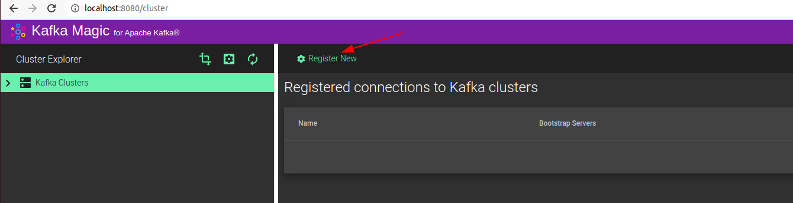
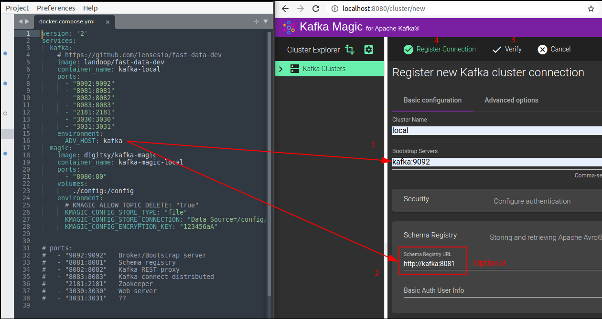
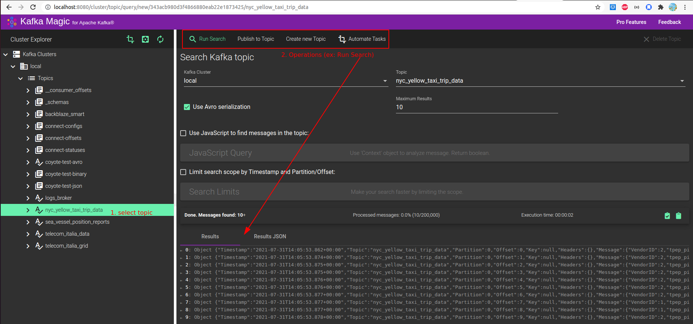

# kafka-local
docker-compose with kafka and kafka-magic to run on local

### Ref
- https://www.kafkamagic.com/start/

### Run
- run docker

```bash
git clone https://github.com/memto/kafka-local.git
docker-compose up
```

- register cluster in kafka-magic UI





